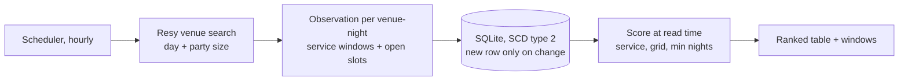
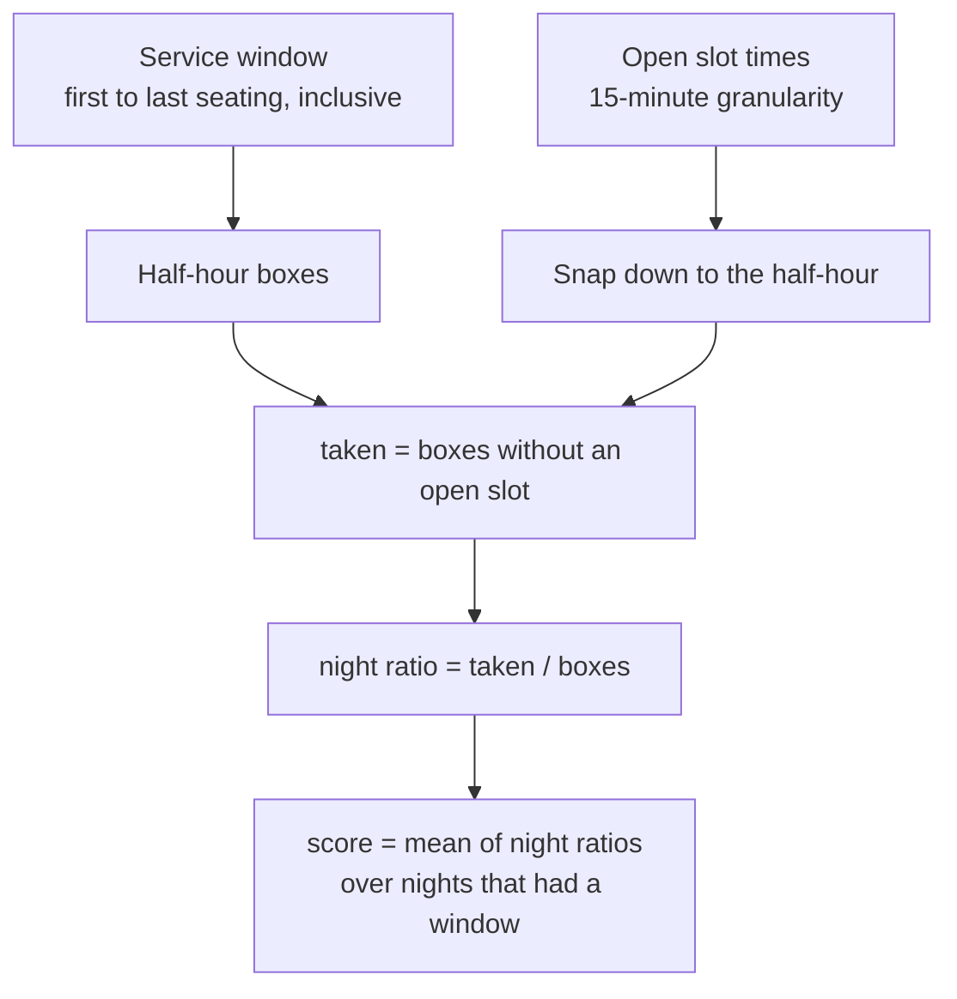
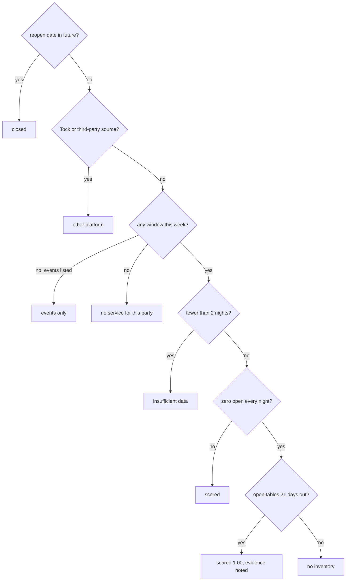

# Methodology

**Question.** For a party of two, how much of a restaurant's book on Resy is gone?

**Answer.** One number per restaurant, 0 to 1. 0: every slot still open. 1: nothing left.

## Pipeline

Every run re-reads the full state: two requests per day per party size, seven nights
plus one verification day three weeks out, two seconds apart. About 16 requests.

## Score

The score is a ratio: slots with nothing left, divided by all slots in the chosen
schedule (dinner by default; lunch, brunch, or all are query parameters).

Example, Izakaya Rintaro, dinner 17:00 to 22:00: 11 boxes. Saturday 0 open: 1.00.
Tuesday 2 open: 0.82. Score over the week: mean of the nightly ratios.

Snapping matters: four 15-minute times inside two half-hours count as two open boxes,
not four. Nights with no window for the party are skipped, not counted as full.

## Who is not scored

Excluded venues are listed with reason and evidence. Empty never passes for full.

## Snapshots

The book changes constantly. A run is a timestamped snapshot; storage keeps only
change. A venue-night row is valid for run R when `first_run_id <= R <= last_seen_run_id`,
so any past run can be re-scored. Ratings are stored per run outside the change hash.

## What the score misses

The ratio is deliberately simple, and it is not enough. It answers "what share of the
book is gone" and nothing else. A fuller measure would need inputs we do not have or
have not used yet:

- **Capacity.** A 14-seat counter and a 200-seat room both read 0.90 when 90% is gone.
  Resy does not disclose seat counts; slot quantity per table type is visible only
  through a per-venue endpoint too costly to poll hourly.
- **Fill speed.** How fast boxes disappear after release is a stronger demand signal
  than how many are gone at one moment. Hourly snapshots and the `fct_fill_speed`
  model exist for this; there is not yet enough history to use it.
- **Release policy.** A venue that releases tables 14 days out looks emptier at 21 days
  than one releasing at 30. The verification day assumes 21 is enough.
- **Prime time.** 19:00 to 20:45 (Resy's own band) going first means more than 17:00
  going first. Unweighted today.
- **Churn.** Boxes that reappear are cancellations; their rate says something about
  demand and about where to find a table.
- **Party size interaction.** Two-tops and four-tops are different inventories.
- **Calendar.** Holidays and events skew any single week.
- **Demand outside Resy.** Walk-ins, phone bookings, and other platforms are invisible.

We are not domain experts in restaurant yield. The current score is a defensible
first cut, not a finished metric. Treat rankings as a shortlist to verify, and expect
the definition to change as the history accumulates and we learn which of the inputs
above actually move it.

## Known judgment calls

- The window comes from Resy's "notify me" range; the last box may be a last-seating
  edge case.
- Chez Panisse and Belotti are outside city limits but carry Resy's SF location code.
  Kept; a city-limits filter is one line.
- Rating letters (S to F) are cut relative to the SF Resy distribution, whose median is
  4.70. They are context, not an input, and flagged for their own evaluation.
